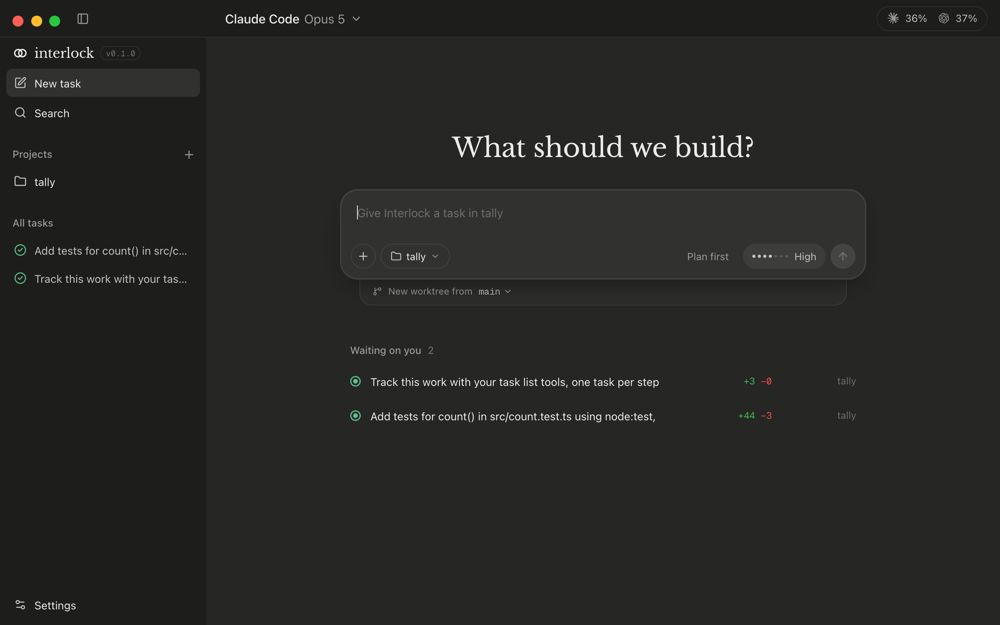
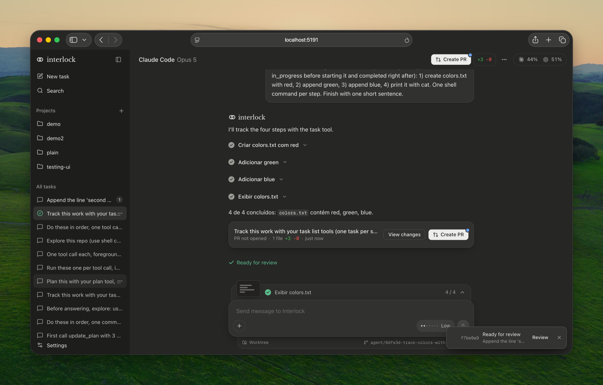
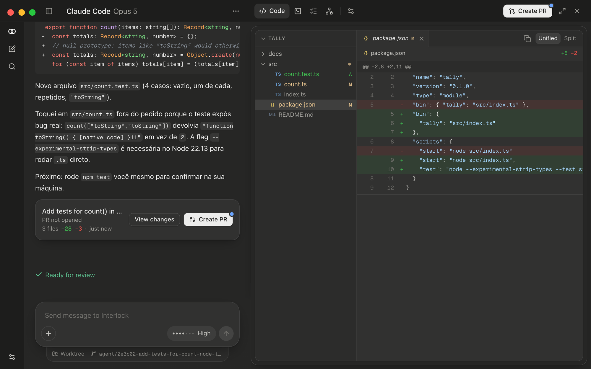
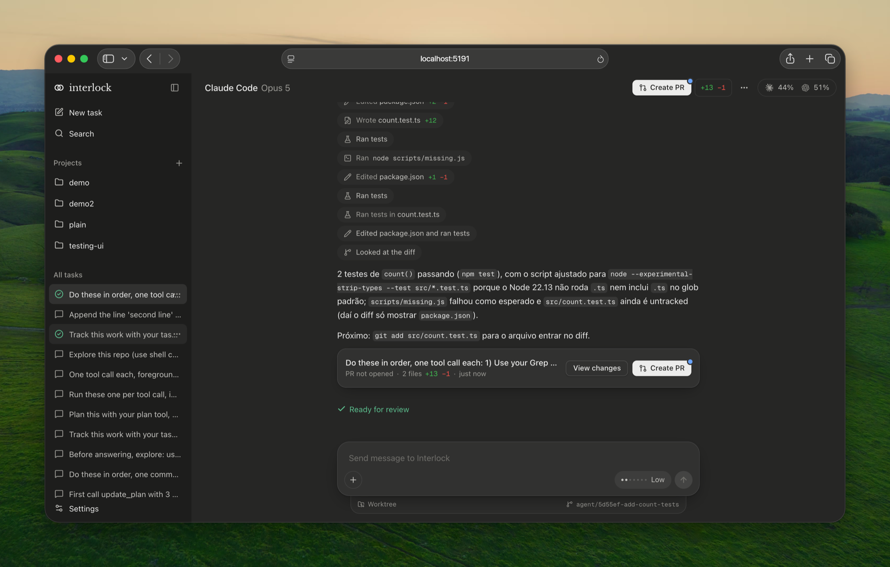
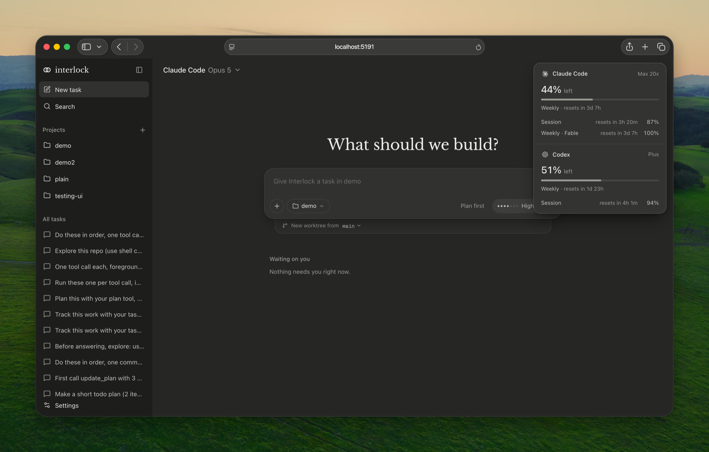

<div align="center">


# Interlock

**Your own coding agents, one calm window.**<br />
Give a task to Claude Code or Codex, let it work in its own git worktree, review the diff, and ship a pull request.

[](#develop)
[](https://tauri.app)
[](https://react.dev)
[](LICENSE)
[](#status)

[What it does](#what-it-does) · [Screenshots](#screenshots) · [Architecture](#architecture) · [Develop](#develop) · [Quality gate](#quality-gate)

<br />



</div>

Interlock runs entirely on your machine. It talks to the Claude and Codex CLIs you already have signed in, and keeps its state in `~/.interlock`. It only interrupts you when it needs you.

## What it does

- **One task, one worktree.** Every task runs on its own branch (`agent/<id>-<slug>`, renamed by AI once the work is clear), so agents never step on each other or on your checkout.
- **Claude Code and Codex, side by side.** Real model and reasoning-effort lists straight from each provider, with in-app sign-in.
- **Plans and progress you can follow.** Native plan tools are enabled for both agents; the conversation shows the steps, and a card behind the composer tracks `n / m`.
- **A readable transcript.** Tool calls read as sentences ("Read 2 files, searched 4 times", "Ran tests", "Edited package.json +2 −1"), exploration collapses into groups, failures stay quiet, and every call expands to its command, output or diff.
- **Review in place.** A file tree and unified or split diff, a terminal in the task's worktree, and Create PR with CI checks through `gh`.
- **Skills in the chat.** Type `/` in the composer to invoke your skills.
- **Remaining usage at a glance.** The pill in the corner shows how much of your Claude and Codex plans is left, from the providers' own usage APIs.
- **Add any folder.** Projects come from the repositories on your Mac, a folder picker, or drag and drop.
- **Made for the Mac.** A unified window bar, native traffic lights, and motion that stays out of the way.

## Screenshots

<table>
  <tr>
    <td width="50%"><br /><sub><b>Plans and steps.</b> The agent's plan, ticked off as it goes.</sub></td>
    <td width="50%"><br /><sub><b>Review.</b> The file tree and diff open beside the conversation.</sub></td>
  </tr>
  <tr>
    <td width="50%"><br /><sub><b>Tool calls as sentences.</b> What ran, in plain words, expandable.</sub></td>
    <td width="50%"><br /><sub><b>Usage.</b> What is left of each plan, and when it resets.</sub></td>
  </tr>
</table>

## Architecture

A Tauri v2 shell supervises a local Node daemon and renders a React app.

| Path                                   | What it is                                                              |
| -------------------------------------- | ----------------------------------------------------------------------- |
| `apps/desktop`                         | Tauri shell: bundles the daemon, menu bar, notifications, folder picker |
| `packages/app`                         | React 19, Vite, Tailwind v4, zustand                                    |
| `packages/server`                      | The daemon: agents, worktrees, terminals, usage, project settings       |
| `packages/protocol`, `packages/client` | Wire schemas and the client the app uses                                |

The daemon listens on `127.0.0.1` with a bearer token. The app only knows protocol shapes inside `src/daemon/` and Tauri-versus-browser differences inside `src/platform/`.

The daemon, protocol and client are a fork of [Paseo](https://github.com/getpaseo/paseo) (Apache-2.0); divergences are tracked in [`docs/upstream-sync.md`](docs/upstream-sync.md).

## Develop

Requirements: macOS on Apple silicon, Node 22, Rust, and the Claude and Codex CLIs signed in. `gh` is needed for pull requests.

```sh
npm install
npm run dev:desktop     # Tauri window with hot reload
npm run dev:app         # the UI alone in a browser (needs VITE_DAEMON_URL and VITE_DAEMON_TOKEN)
npm run dev:daemon      # the daemon alone
npm run build:desktop   # unsigned Interlock.app and .dmg
```

## Quality gate

`npm run check` runs formatting (oxfmt), type-aware ESLint with a baseline that can only shrink, strictest TypeScript, structure rules, knip, duplicate detection and the tests. Git hooks run the same checks, and `--no-verify` is not an option. Conventions for people and agents live in [`CLAUDE.md`](CLAUDE.md); the product spec is [`docs/spec-v1.md`](docs/spec-v1.md) and the decisions behind it are in [`docs/decisions`](docs/decisions).

## Status

Early and in active development, built for one person's daily use first. macOS only for now. Not signed or notarized.

## License

Apache-2.0. See [`LICENSE`](LICENSE) and [`NOTICE`](NOTICE).
